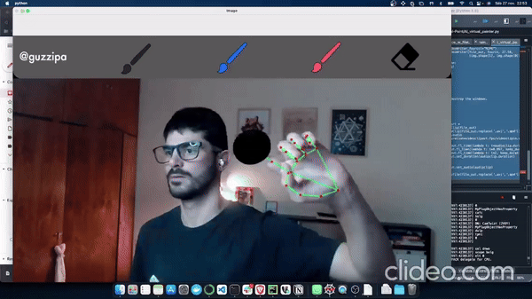

# Virtual Board 🖌️

Un proyecto interactivo que convierte tu cámara en un tablero virtual para dibujar usando gestos de la mano. 🚀

Usando **OpenCV** y **MediaPipe**, detecta tus gestos y permite seleccionar colores, dibujar líneas y hasta borrar con un "goma virtual". Ideal para explorar visión por computadora y aplicaciones creativas.


## ✨ Características

- Detección de manos usando MediaPipe.
- Selección de colores a través de gestos.
- Herramienta de dibujo con ajuste de grosor.
- Goma de borrar virtual.


## 🚀 Cómo usarlo

1. Cloná este repositorio:
   ```bash
   git clone https://github.com/guzzipa/virtual-board.git
   cd virtual-board

2. Instalá las dependencias:
bash
pip install -r requirements.txt

3. Ejecutá el proyecto:

bash python main.py


## 🎥 Demo

¡Mirá cómo funciona Virtual Board en acción! 👇



https://www.linkedin.com/feed/update/urn:li:activity:6870736105537368064/?originTrackingId=17rDTDNtQROf0JgDiwlQ1g%3D%3D
